# hse_hw1_meth

Ссылка на колаб: https://colab.research.google.com/drive/1PRxvZXX11e-ll9xuho3jLrw4qTf-RNVn?usp=sharing
## Part 1

Отчеты в папке fastq. 1 картинка - rNA-seq мыши из 3-ДЗ, 2 картинка - 8cell, 3 картинка - Epiblast, 4 картинка - ICM.

#### GC
У rNA мыши процент GC ± в 2 раза больше чем у метиллированияю.

  
  
  
  

#### Sequence quality scores

У метиллирования в конце секвенирования падает quality score, в отличие от rNA.

  
  
  
  

## Part 2
### 2.a

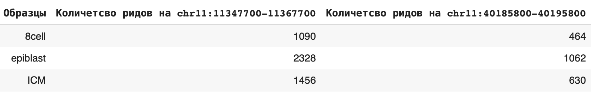

### 2.b

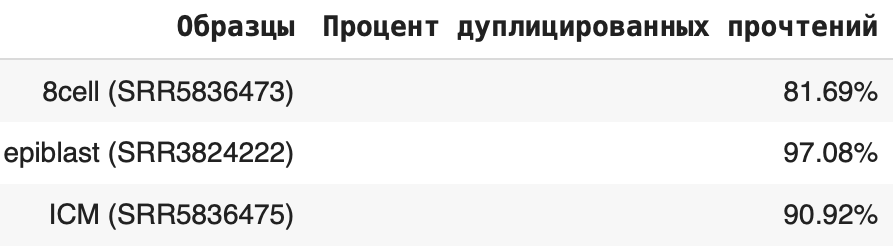

(Доп. балл: скрипт находится в /scr/script.sh)

### 2.d

Отчеты в папке reports. Все кривые примерно одинаковые во всех образцах, кроме CPG: в 8 cell их ~ 45%, в epiblast ~ 75%, в ICM ~ 25%.

#### 8 cell
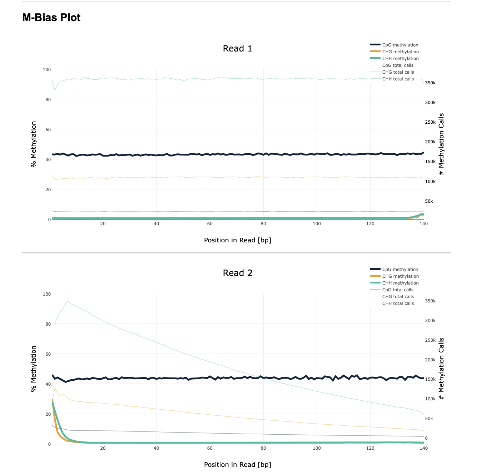
#### Epiblast
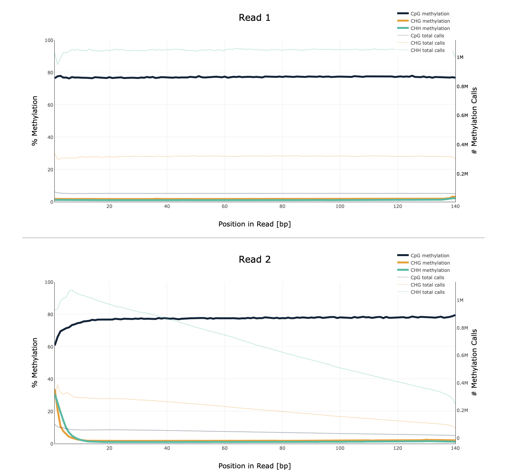
#### ICM
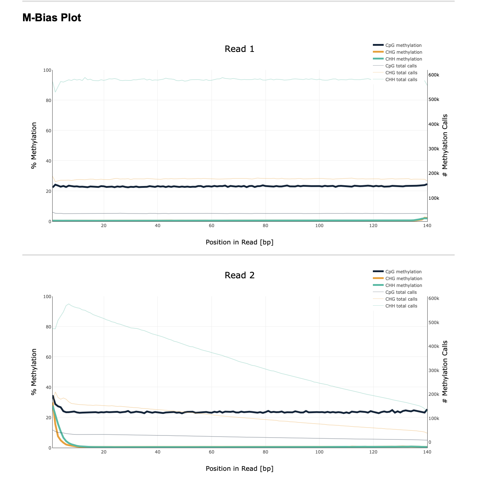

### 2.e

Строим графики:

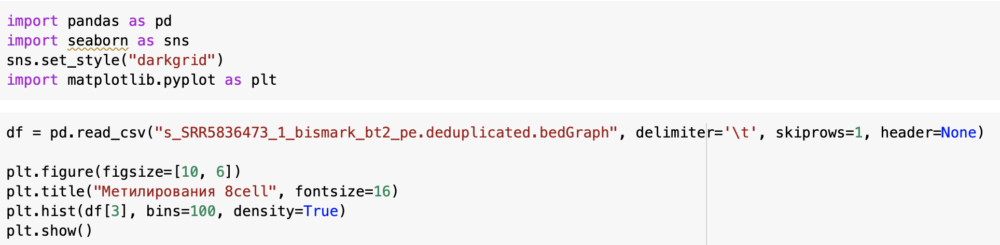

Графики:

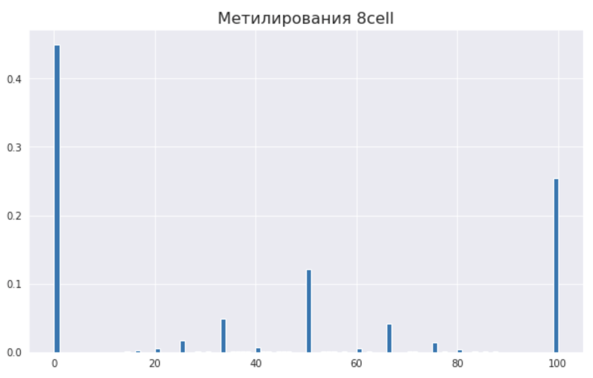
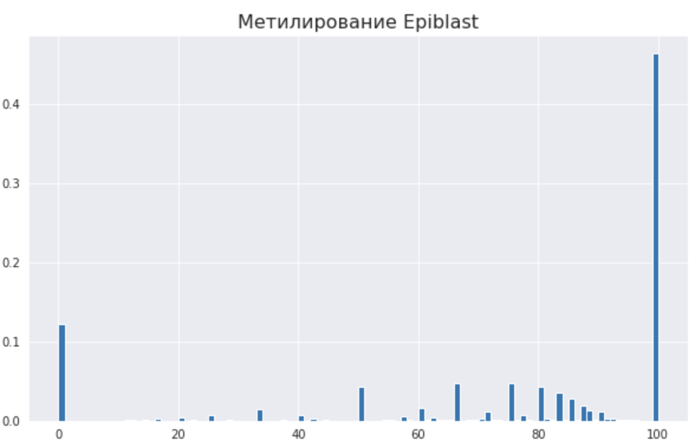
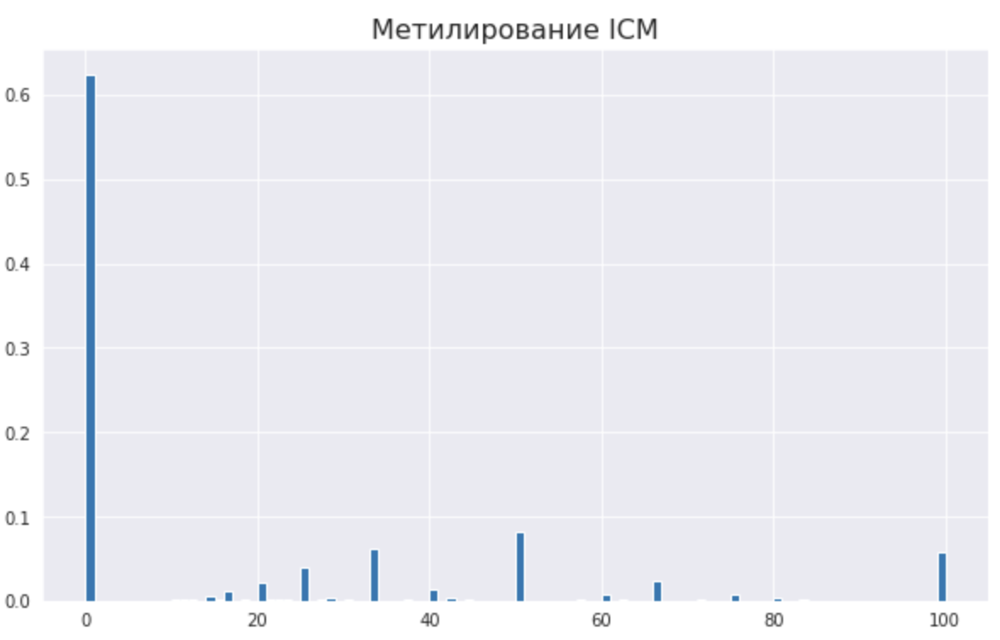

### 2.f

Метилирование и покрытие:

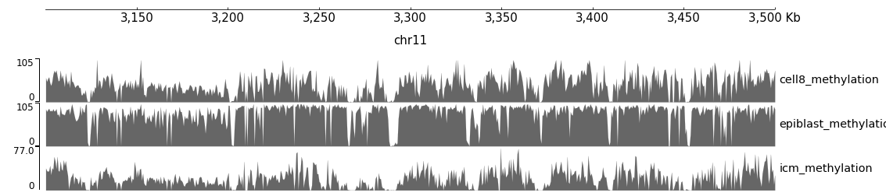
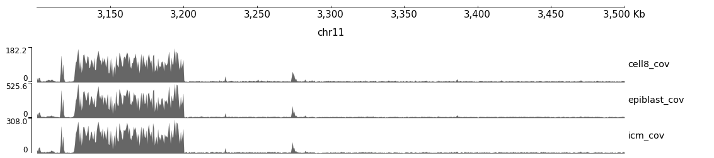
